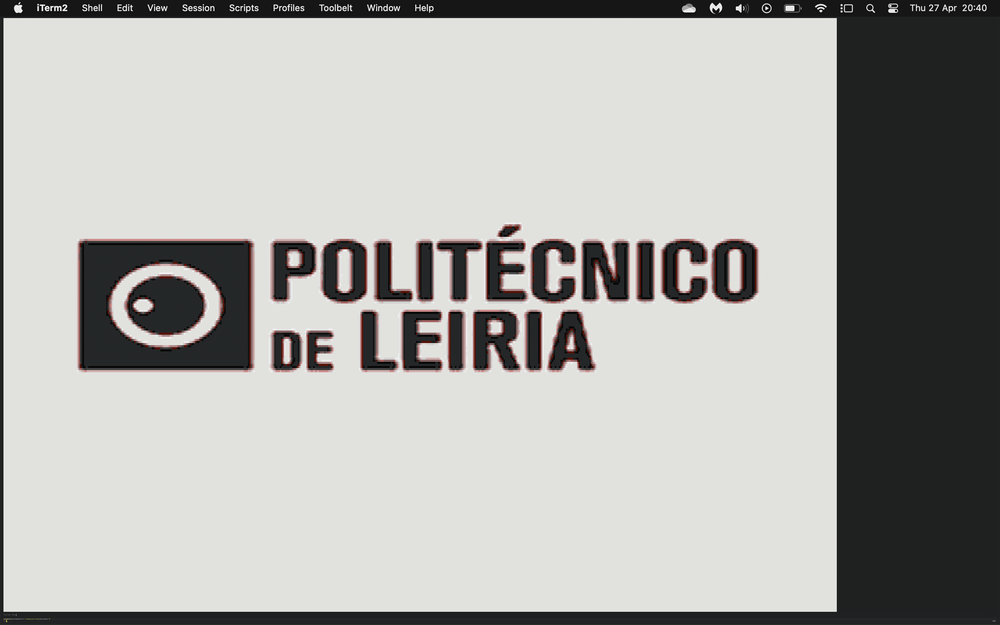
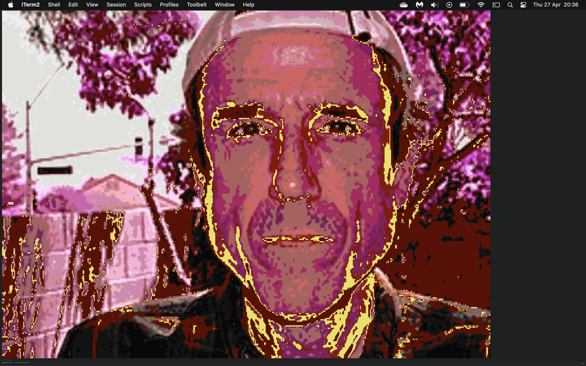

# G-CLI

**G-CLI** (_Graphical CLI_) is a terminal utility for rendering images on the terminal written in C. It was originally developed to visualize the output of a [perceptron](https://en.wikipedia.org/wiki/Perceptron) implementation I made.

Additionaly it will be possible to combine Olive-C's in memory graphics library to provide an interface for rendering Olive-C canvas's on the terminal.

> Be bold: use the terminal the way you **weren't** supposed to.

## Installation

```bash
git clone https://github.com/JoaoAJMatos/g-cli.git
cd g-cli
./build.sh
```

## Usage

```bash
gcli -f image.png
```

## Output


